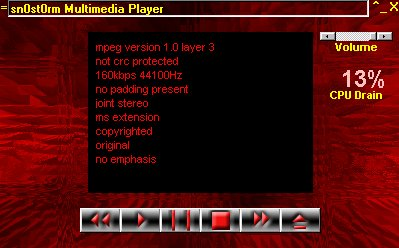



## sn0st0rm MMP Final Release

### Description

This is the final public beta of sn0st0rm MMP. Many issues have been addressed and resolved. This is the sourcecode ONLY, if you need the DLLs, you will need to download them from my website due to PSC's new "no dll" rule. If you have the previous version of sn0st0rm MMP, you *should* have the DLLs, but don't quote me on that =) Anyways, you'll find a TON of bugfixes and improvements in this version. Thanks to everyone who sent bug reports last time, they helped out a lot! This is the final public beta, so keep those bug reports coming if you find any! And as always, enjoy!
 
### More Info
 

             |
---                |---
**Submitted On**   |2001-04-01 16:04:26
**By**             |[Dave Perry](https://github.com/Planet-Source-Code/PSCIndex/blob/master/ByAuthor/dave-perry.md)
**Level**          |Advanced
**User Rating**    |4.0 (16 globes from 4 users)
**Compatibility**  |VB 4\.0 \(32\-bit\), VB 5\.0, VB 6\.0
**Category**       |[Sound/MP3](https://github.com/Planet-Source-Code/PSCIndex/blob/master/ByCategory/sound-mp3__1-45.md)
**World**          |[Visual Basic](https://github.com/Planet-Source-Code/PSCIndex/blob/master/ByWorld/visual-basic.md)
**Archive File**   |[sn0st0rm M17788412001\.zip](https://github.com/Planet-Source-Code/dave-perry-sn0st0rm-mmp-final-release__1-22070/archive/master.zip)

